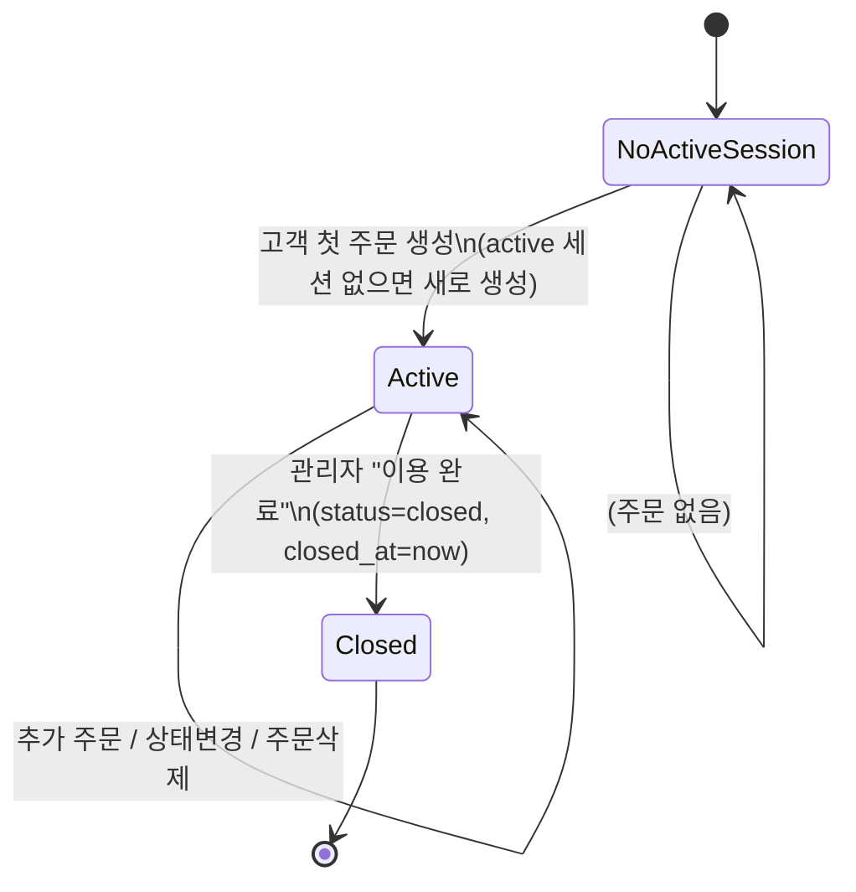
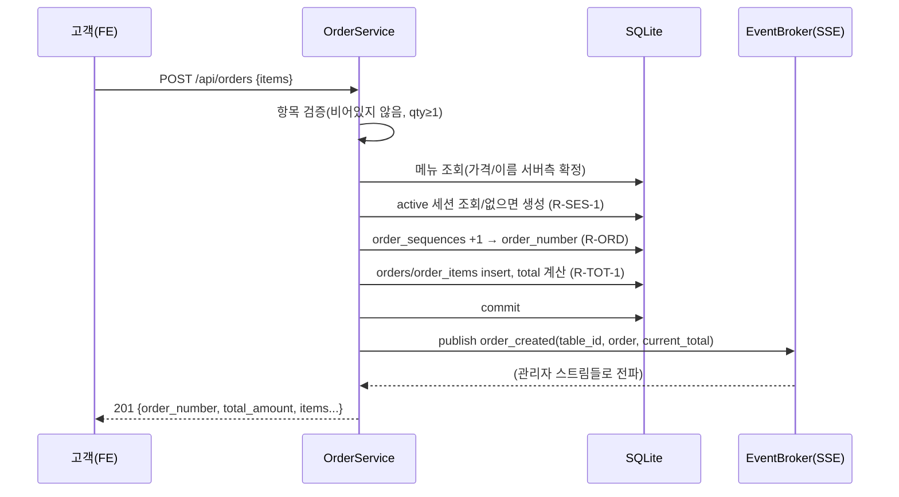

# Business Rules — 상세 비즈니스 규칙 (Functional Design 흡수)

/ Written at (KST): 2026-09-07 12:30 /

> 이 문서는 통상 construction의 Functional Design에 해당하는 **상세 로직**을 inception에 잠근 것입니다.
> construction에서 새 결정이 없도록, 상태 전이·계산·검증·인증 규칙을 여기서 확정합니다.

## 1. 테이블 세션 라이프사이클 (상태머신)

규칙:
- **R-SES-1**: 주문 생성 시 해당 테이블의 `active` 세션을 찾는다. 없으면 새 세션(`active`, `started_at=now`)을 만들고 그 세션에 주문을 붙인다.
- **R-SES-2**: 한 테이블에 `active` 세션은 **최대 1개**(불변식).
- **R-SES-3**: "이용 완료"는 active 세션을 `closed`(+`closed_at`)로 전환. 주문 데이터는 그대로 두고 **논리적으로만** 과거로 이동(Q5=A).
- **R-SES-4**: 세션 종료 후 같은 테이블에서 새 주문이 오면 R-SES-1에 따라 **새 세션**이 시작(이전 내역과 분리).
- **R-SES-5**: closed 세션은 관리자 "과거 내역"에서만 조회. 고객 `현재 주문 내역`과 대시보드 현재 총액에는 나타나지 않는다.

## 2. 총액 계산

- **R-TOT-1 (주문 총액)**: `order.total_amount = Σ(item.unit_price × item.quantity)`. 항목 `line_total`도 동일식으로 저장.
- **R-TOT-2 (테이블 현재 총액)**: 해당 테이블 **active 세션**의 모든 주문 `total_amount` 합. active 세션 없으면 0.
- **R-TOT-3 (재계산 트리거)**: 주문 생성/삭제 시 R-TOT-2로 현재 총액을 재계산해 응답·SSE에 반영. 상태 변경은 총액에 영향 없음.
- **R-TOT-4 (세션 종료 리셋)**: 세션 종료로 active 세션이 사라지면 현재 총액은 자동 0(별도 리셋 저장 불필요).

## 3. 주문번호 생성 (Q3=A: 매장·일 단위 글로벌 시퀀스)

- 형식: **`YYYYMMDD-HHMM-####`** (예: `20260907-1526-0001`).
- `YYYYMMDD`, `HHMM`: 주문 생성 시각을 **KST(Asia/Seoul)** 로 변환해 산출.
- `####`: `order_sequences(store_id, seq_date=YYYYMMDD)`의 `last_seq`를 **주문 생성 트랜잭션 안에서 +1** 하여 부여(그 매장·그 날 유일, 4자리 zero-pad).
- **R-ORD-1**: 시퀀스는 하루(자정~자정, KST) 단위. 분(HHMM)은 표시용일 뿐 리셋 기준이 아니다.
- **R-ORD-2**: `order_number`는 전역 UNIQUE. 동시 생성은 SQLite 트랜잭션 직렬화 + 시퀀스 원자 증가로 충돌 방지.
- 예: 09-07 15:26 첫 주문 `20260907-1526-0001`, 15:40 두 번째 `20260907-1540-0002`.

## 4. 주문 생성 처리 순서 (트랜잭션)

- **R-CRE-1**: 가격은 **서버 DB 기준**으로 확정(클라이언트 전송 가격 무시).
- **R-CRE-2**: 존재하지 않는 menu_id 포함 시 404, 항목 없음/수량<1 시 400. 이때 주문은 생성되지 않음.
- **R-CRE-3**: 커밋 성공 후에만 SSE 이벤트 발행.

## 5. 주문 상태 / 삭제

- **R-ST-1**: 상태값은 `pending`|`preparing`|`completed` 3종만 허용(그 외 400). MVP는 임의 전이 허용(엄격한 forward-only 강제 안 함). 대표 흐름: pending→preparing→completed.
- **R-ST-2**: 상태 변경 시 `updated_at` 갱신 후 `order_updated` SSE 발행.
- **R-DEL-1**: 직권 삭제는 order + order_items(CASCADE) 삭제. 삭제 후 R-TOT-2로 현재 총액 재계산, `order_deleted` SSE 발행.
- **R-DEL-2**: 삭제로 세션 주문이 0개가 되어도 세션은 active 유지(현재 총액만 0). 확인 팝업은 FE 책임.

## 6. 인증 / 권한

- **R-AUTH-1 (관리자)**: `store_id`+`username`+`password`. `password_hash` bcrypt 검증. 성공 시 JWT(role=`admin`, store_id, username, exp=16h).
- **R-AUTH-2 (테이블)**: `store_id`+`table_number`+`password`(테이블 비밀번호) bcrypt 검증. 성공 시 JWT(role=`table`, store_id, table_id, table_number, exp=16h).
- **R-AUTH-3**: 토큰 만료/서명불일치/누락 → 401. role 불일치(고객 토큰으로 관리자 API 등) → 403.
- **R-AUTH-4 (SSE)**: `/api/admin/stream`은 `?token=` 쿼리로 검증(EventSource 헤더 제약). role=admin 아니면 403.
- **R-AUTH-5**: JWT 비밀키·TTL은 config(env)에서 로드. HS256. (로그인 시도 제한은 범위 외.)

## 7. 메뉴 관리 검증

- **R-MENU-1**: 등록/수정 시 `name` 비어있지 않음, `price` 정수 ≥ 0, `category_id` 존재. 위반 400.
- **R-MENU-2**: 삭제는 hard delete. 과거 주문 항목은 스냅샷(menu_name/unit_price)으로 보존되어 표시에 영향 없음.
- **R-MENU-3**: `display_order`로 고객 화면 노출 순서 제어.

## 8. 시드 (서버 시작 시 1회, 이미 있으면 skip)

- 매장 `store001` "데모 식당" / 관리자 `admin`·`admin1234`(bcrypt) / 테이블 T1~T6(비번 `0000` bcrypt) / 카테고리 메인·사이드·음료 / 메뉴 약 10개(가격·설명·placeholder image_url).
- **R-SEED-1**: 멱등 — 매장 존재 시 시드 skip(재시작해도 중복 생성 안 함).
