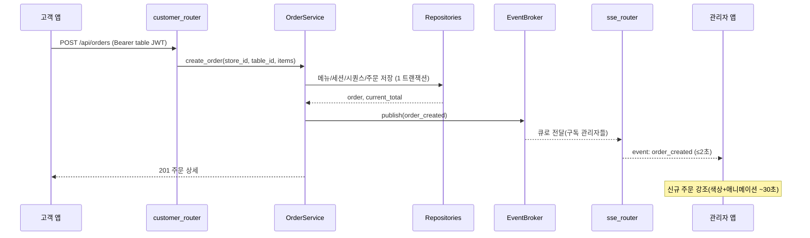
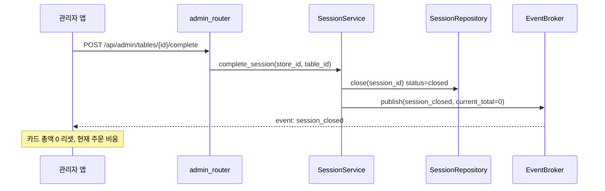

# Component Dependency — 의존 관계·통신·데이터 흐름

/ Written at (KST): 2026-09-07 12:55 /

## 의존성 매트릭스 (행이 열에 의존)
| ↓ 의존 \ 대상 → | routers | services | repositories | core.security | core.db | core.EventBroker |
|---|---|---|---|---|---|---|
| **routers** | - | ✅ | - | ✅(인증 의존성) | - | ✅(sse_router 구독) |
| **services** | - | ✅(서비스 간 일부) | ✅ | ✅(토큰 발급) | - | ✅(발행) |
| **repositories** | - | - | - | - | ✅ | - |
| **core.seed** | - | - | ✅ | - | ✅ | - |

- 의존 방향은 **안쪽으로만**(routers→services→repositories→db). 역방향 없음.
- 서비스 간 의존: `OrderService → SessionService`, `DashboardService → (OrderRepository/SessionRepository)`.

## 통신 패턴
- **FE ↔ BE**: REST(JSON) + 단일 SSE 스트림. 인증은 REST=Bearer 헤더, SSE=쿼리토큰.
- **BE 내부**: 동기 함수 호출(레이어 간). SSE만 asyncio 큐 기반 비동기 팬아웃.
- **실시간 팬아웃**: 상태를 바꾸는 서비스가 `EventBroker.publish` → 구독 중인 모든 관리자 큐로 전파 → 각 SSE 응답 제너레이터가 클라이언트로 push.

## 데이터 흐름: 주문 → 실시간 반영

## 데이터 흐름: 세션 종료(이용 완료)

## 프런트 구조(정적, 논리 화면)
| 화면 | 소속 앱 | 주요 API |
|---|---|---|
| 메뉴/카트 | 고객 `/` | GET /api/menu, POST /api/orders |
| 주문 완료(번호표시→~5초 후 메뉴 복귀) | 고객 | (POST 응답) |
| 현재 주문 내역 | 고객 | GET /api/orders/current |
| 관리자 로그인 | 관리자 `/admin` | POST /api/admin/login |
| 대시보드(테이블 그리드+SSE) | 관리자 | GET /api/admin/tables, GET /api/admin/stream |
| 테이블 상세/상태변경/삭제/이용완료 | 관리자 | tables/{id}/orders, orders/{id}/status, DELETE, complete |
| 과거 내역(날짜필터) | 관리자 | tables/{id}/history |
| 메뉴 관리 | 관리자 | /api/admin/menus, /api/admin/categories |
