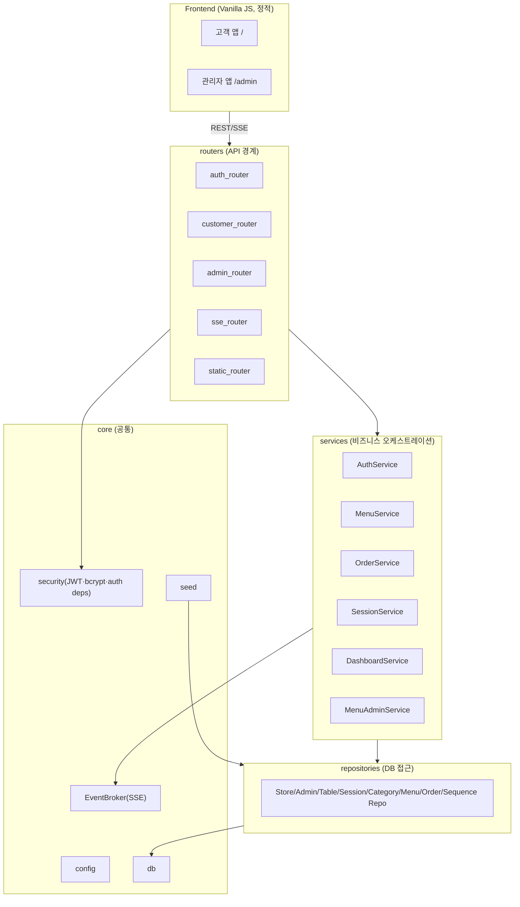

# Components — 컴포넌트 정의·책임·인터페이스

/ Written at (KST): 2026-09-07 12:40 /

> 아키텍처(Q1=A): **레이어드**. 의존 방향은 안쪽으로. `routers → services → repositories → (SQLite)`, 공통은 `core`.
> 스택: FastAPI + SQLAlchemy ORM + Pydantic + bcrypt + PyJWT(또는 python-jose). 프런트: Vanilla JS(정적).

## 레이어 개요

## 컴포넌트 목록

### routers (API 경계 — 얇게 유지, 검증·인증 후 서비스 위임)
| 컴포넌트 | 책임 | 주요 인터페이스(엔드포인트) |
|---|---|---|
| auth_router | 관리자/테이블 인증 | `POST /api/admin/login`, `POST /api/table/auth` |
| customer_router | 고객 기능(role=table) | `GET /api/menu`, `POST /api/orders`, `GET /api/orders/current` |
| admin_router | 관리자 기능(role=admin) | tables 요약/상세/history, 주문 상태변경/삭제, 세션 complete, 테이블·메뉴 관리 |
| sse_router | 실시간 스트림 | `GET /api/admin/stream?token=` |
| static_router | 정적 서빙 | `/`, `/admin`, `/static/*` |

### services (비즈니스 로직 — business-rules.md 규칙 구현)
| 컴포넌트 | 책임 |
|---|---|
| AuthService | 관리자·테이블 자격 검증, JWT 발급 (R-AUTH-1/2) |
| MenuService | 고객 메뉴 조회(카테고리+메뉴 구성) |
| OrderService | 주문 생성(가격 확정·시퀀스·세션연결·총액·SSE), 현재세션 주문 조회, 상태변경, 삭제 (R-CRE/R-ST/R-DEL/R-TOT/R-ORD) |
| SessionService | active 세션 조회/생성, 세션 종료 (R-SES) |
| DashboardService | 테이블별 요약(총액·최신3), 상세, 과거내역(날짜필터) |
| MenuAdminService | 카테고리/메뉴 CRUD·노출순 (R-MENU) |

### repositories (데이터 접근 — 쿼리 캡슐화, 비즈니스 로직 없음)
| 컴포넌트 | 책임 |
|---|---|
| StoreRepository | 매장 조회 |
| AdminRepository | 관리자 계정 조회 |
| TableRepository | 테이블 조회/생성 |
| SessionRepository | 세션 조회(active)/생성/종료 |
| CategoryRepository | 카테고리 CRUD |
| MenuRepository | 메뉴 CRUD/조회 |
| OrderRepository | 주문/항목 CRUD, 세션별·테이블별 조회, 총액 집계 |
| SequenceRepository | order_sequences 원자적 증가 |

### core (공통 인프라)
| 컴포넌트 | 책임 |
|---|---|
| config | 설정(JWT secret, TTL=16h, DB 경로, seed 토글) |
| db | SQLAlchemy 엔진/세션, 스키마 생성 |
| security | bcrypt 해시/검증, JWT 인코드/디코드, FastAPI 의존성 `get_current_admin`/`get_current_table` (R-AUTH-3/4) |
| EventBroker | SSE 인메모리 pub/sub(관리자 연결별 asyncio 큐), publish/subscribe |
| seed | 시작 시 멱등 시드 (R-SEED-1) |
