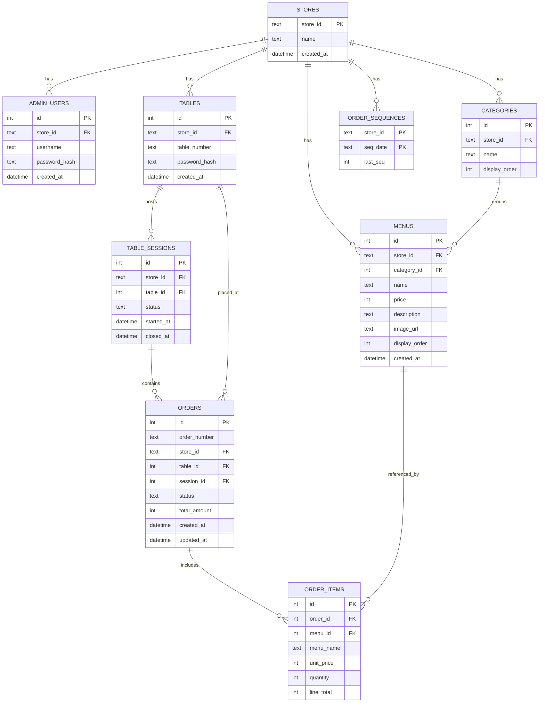

# Data Model — SQLite 스키마

/ Written at (KST): 2026-09-07 12:10 /

> 확정 기술: **SQLite + SQLAlchemy ORM**, 요청/응답은 **Pydantic** 스키마. 금액은 원(KRW) 정수(INTEGER)로 저장.
> 시간: `created_at` 등은 UTC로 저장. **주문번호의 날짜·시각(YYYYMMDD-HHMM)은 KST(Asia/Seoul) 기준**으로 계산(§business-rules 참조).

## 개요 (ERD)

## 테이블 상세 (9개)

### 1. stores — 매장
| 컬럼 | 타입 | 제약 | 설명 |
|---|---|---|---|
| store_id | TEXT | PK | 예: `store001` |
| name | TEXT | NOT NULL | 예: "데모 식당" |
| created_at | DATETIME | NOT NULL | UTC |

### 2. admin_users — 관리자 계정
| 컬럼 | 타입 | 제약 | 설명 |
|---|---|---|---|
| id | INTEGER | PK, AUTOINC | |
| store_id | TEXT | FK→stores | |
| username | TEXT | NOT NULL, UNIQUE(store_id, username) | 예: `admin` |
| password_hash | TEXT | NOT NULL | **bcrypt 해시** |
| created_at | DATETIME | NOT NULL | UTC |

### 3. tables — 테이블
| 컬럼 | 타입 | 제약 | 설명 |
|---|---|---|---|
| id | INTEGER | PK, AUTOINC | 내부 ID |
| store_id | TEXT | FK→stores | |
| table_number | TEXT | NOT NULL, UNIQUE(store_id, table_number) | 예: `T1` |
| password_hash | TEXT | NOT NULL | 테이블 비밀번호 **bcrypt 해시**(시드 `0000`) |
| created_at | DATETIME | NOT NULL | UTC |

### 4. table_sessions — 테이블 세션 (라이프사이클의 중심)
| 컬럼 | 타입 | 제약 | 설명 |
|---|---|---|---|
| id | INTEGER | PK, AUTOINC | = 세션ID |
| store_id | TEXT | FK→stores | |
| table_id | INTEGER | FK→tables | |
| status | TEXT | NOT NULL, `active`\|`closed` | |
| started_at | DATETIME | NOT NULL | 첫 주문 시점(UTC) |
| closed_at | DATETIME | NULL | "이용 완료" 시각(UTC) |

- **핵심 불변식**: 한 테이블에 `status=active` 세션은 **최대 1개**.
- **논리적 이동(Q5=A)**: 세션 종료는 물리 이동이 아니라 `status=closed`로 전환. 활성 화면은 active 세션만, 과거 내역은 closed 세션만 조회.

### 5. categories — 메뉴 카테고리
| 컬럼 | 타입 | 제약 | 설명 |
|---|---|---|---|
| id | INTEGER | PK, AUTOINC | |
| store_id | TEXT | FK→stores | |
| name | TEXT | NOT NULL | 메인/사이드/음료 |
| display_order | INTEGER | NOT NULL, default 0 | 노출 순서 |

### 6. menus — 메뉴
| 컬럼 | 타입 | 제약 | 설명 |
|---|---|---|---|
| id | INTEGER | PK, AUTOINC | |
| store_id | TEXT | FK→stores | |
| category_id | INTEGER | FK→categories | |
| name | TEXT | NOT NULL | |
| price | INTEGER | NOT NULL, ≥ 0 | 원(KRW) |
| description | TEXT | NULL | |
| image_url | TEXT | NULL | 없으면 FE placeholder |
| display_order | INTEGER | NOT NULL, default 0 | |
| created_at | DATETIME | NOT NULL | UTC |

- 메뉴 삭제는 **hard delete**. 주문 항목은 아래처럼 스냅샷을 보관하므로 과거 주문 표시에 영향 없음.

### 7. orders — 주문 (세션에 소속)
| 컬럼 | 타입 | 제약 | 설명 |
|---|---|---|---|
| id | INTEGER | PK, AUTOINC | |
| order_number | TEXT | NOT NULL, UNIQUE | `YYYYMMDD-HHMM-####` |
| store_id | TEXT | FK→stores | |
| table_id | INTEGER | FK→tables | |
| session_id | INTEGER | FK→table_sessions | 소속 세션 |
| status | TEXT | NOT NULL, `pending`\|`preparing`\|`completed` | 기본 `pending` |
| total_amount | INTEGER | NOT NULL | 항목 line_total 합 |
| created_at | DATETIME | NOT NULL | UTC |
| updated_at | DATETIME | NOT NULL | UTC |

### 8. order_items — 주문 항목 (가격·이름 스냅샷 보관)
| 컬럼 | 타입 | 제약 | 설명 |
|---|---|---|---|
| id | INTEGER | PK, AUTOINC | |
| order_id | INTEGER | FK→orders (ON DELETE CASCADE) | |
| menu_id | INTEGER | FK→menus, NULL 허용 | 원본 참조(삭제되면 NULL) |
| menu_name | TEXT | NOT NULL | **주문 시점 스냅샷** |
| unit_price | INTEGER | NOT NULL | **주문 시점 스냅샷 단가** |
| quantity | INTEGER | NOT NULL, ≥ 1 | |
| line_total | INTEGER | NOT NULL | unit_price × quantity |

### 9. order_sequences — 주문번호 일련번호(원자적 증가)
| 컬럼 | 타입 | 제약 | 설명 |
|---|---|---|---|
| store_id | TEXT | PK(store_id, seq_date) | |
| seq_date | TEXT | PK | `YYYYMMDD` (KST) |
| last_seq | INTEGER | NOT NULL | 그 매장·그 날의 마지막 일련번호 |

- 주문 생성 트랜잭션 안에서 `last_seq += 1` 하여 그날 유일한 4자리 시퀀스를 확보(Q3=A: **매장·일 단위 글로벌**).

## 총액·현재상태 계산 원칙 (파생값)
- **테이블 현재 총액** = 해당 테이블의 **active 세션** orders 의 `total_amount` 합. active 세션이 없으면 0.
- 세션 종료(closed) 시 active 세션이 사라지므로 현재 총액은 자연히 0으로 리셋(별도 리셋 로직 불필요).
- 주문 삭제 시에도 위 합산으로 재계산되므로 별도 저장 필드 불필요.
