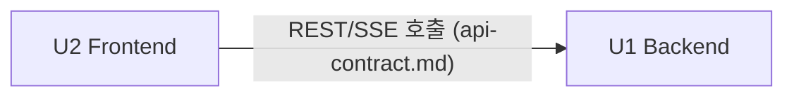

# Unit of Work — 의존성 매트릭스

/ Written at (KST): 2026-09-07 13:27 /

## 유닛 간 의존
| 유닛 | 의존 대상 | 성격 |
|---|---|---|
| U1 Backend | (없음) | 독립. 먼저 완성·검증 가능 |
| U2 Frontend | **U1 Backend** | 런타임 의존: 확정 API 호출. 개발도 U1 완료 후 시작 |

## 계약이 곧 경계
- U1↔U2의 유일한 결합점은 **api-contract.md**. 계약이 고정돼 있으므로 두 유닛은 독립적으로 구현 가능하고, 왕복(back-and-forth)이 필요 없다.
- U1은 계약을 **구현**하고, U2는 계약을 **소비**한다.

## 공유 리소스
- **DB(SQLite)**: U1만 접근. U2는 API를 통해서만 데이터에 접근.
- **정적 서빙**: 단일 서버가 U2 산출물(static/)을 서빙. 별도 프로세스 없음.

## 통신 패턴
- U2 → U1: HTTP REST(JSON, Bearer 헤더) + SSE(쿼리 토큰).
- U1 내부: 동기 함수 호출(레이어) + SSE만 비동기 팬아웃.

## 리스크/완화
- U1 계약 구멍이 U2 개발 중 드러날 위험 → 계약을 inception에서 확정했고, 발견 시 임의 변경 없이 **반문** 후 재확정(source of truth).
