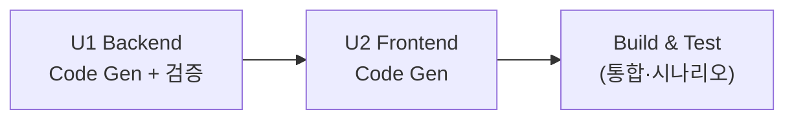

# Unit of Work — 유닛 정의·책임 + 코드 조직 전략

/ Written at (KST): 2026-09-07 13:25 /

## 배포 모델
- **단일 배포 서비스**: FastAPI 서버 1개(1 프로세스)가 REST/SSE API + 정적 프런트를 함께 서빙.
- 아래 "유닛"은 **개발(코드 생성) 단위**이며, 배포 단위가 아니다. 두 유닛 모두 같은 서비스에 속한다.

## 개발 유닛 (2개, 순차)

### U1 — Backend (API + DB + Core)
| 항목 | 내용 |
|---|---|
| 책임 | 데이터 모델·비즈니스 규칙(R-*)·REST/SSE API·인증·시드 |
| 포함 모듈 | `app/core`(config·db·security·events·seed), `app/models`, `app/schemas`, `app/repositories`, `app/services`, `app/routers`, `tests/` |
| 완료 정의(DoD) | api-contract.md의 모든 엔드포인트가 계약대로 응답, 핵심 로직 단위 테스트 통과(세션 라이프사이클·총액·주문 생성·주문번호) |
| 검증 | pytest + 수동 curl/HTTP 확인 |

### U2 — Frontend (Static Web)
| 항목 | 내용 |
|---|---|
| 책임 | 고객 앱(메뉴/카트/주문/현재내역), 관리자 앱(로그인/대시보드+SSE/테이블·메뉴 관리) |
| 포함 모듈 | `static/index.html`(고객), `static/admin.html`(관리자), `static/js`, `static/css`, `static/img`(placeholder) |
| 전제 | **U1 완료·검증 후 시작** (확정 API에 결합, 왕복 최소화) |
| 완료 정의(DoD) | requirements §6 시나리오 1~5를 브라우저에서 수동 워크스루 통과 |

## 코드 조직 전략 (Greenfield)
```text
table-order/
├── app/                    # U1 Backend
│   ├── main.py             # 앱 조립: 라우터 등록, startup 시드, StaticFiles 마운트
│   ├── core/               # config, db, security(JWT·bcrypt), events(SSE broker), seed
│   ├── models/             # SQLAlchemy 9개 테이블
│   ├── schemas/            # Pydantic 요청/응답 (api-contract.md와 1:1)
│   ├── repositories/       # DB 접근(비즈니스 로직 없음)
│   ├── services/           # 비즈니스 규칙(R-*), 트랜잭션, SSE 발행
│   └── routers/            # auth / customer / admin / sse / static
├── static/                 # U2 Frontend
│   ├── index.html          # 고객
│   ├── admin.html          # 관리자
│   ├── css/  js/  img/
├── tests/                  # U1 단위 테스트
├── requirements.txt
└── table_order.db          # 런타임 생성(SQLite)
```

## 유닛 완료 순서 (construction 루프)


---

## 구현 실행 규약 (문서·커밋·브랜치)

> construction에서 **구현과 문서·커밋을 함께** 진행하기 위한 유닛 공통 규약. 사람이 코드를 열지 않아도 이해할 수 있는 문서, 리뷰 가능한 논리 단위 커밋, 지속적 브랜치·병합을 원칙으로 한다.

### 문서 체계 (두 축 공존)
| 위치 | 역할 | 시점 |
|---|---|---|
| `aidlc-docs/` | 설계 원장(WHAT/WHY, source of truth) | inception에서 확정(완료) |
| `docs/tasks/` | 유닛 작업 설명 `yyyy-mm-dd-NN_<summary>_plan.md` / `_result.md` | 유닛 시작/종료 |
| `docs/guide/` | 사람용 현재상태 가이드(아래 5종 중 **필요분만**) | 구현하며 생성·갱신 |
| `work/todo.md` | 진행 중 상태(임시, **커밋 금지**) | 유닛 진행 중 |
| `README.md` | 진입점 | 진입점 이해가 바뀔 때만 |

- `docs/guide/` 표준 5종: `architecture.md`, `development.md`, `configuration.md`, `troubleshooting.md`, `lessons.md`.
- **세트 채우기용으로 미리 만들지 않는다.** 그 작업이 담을 durable 정보가 실제로 생길 때만 생성/갱신.
- `docs/tasks/`에는 plan/result만 둔다(인덱스·리포트·스크래치 금지).

### 유닛별 루프 (U1, U2 각각 동일 적용)
```text
0. lessons 확인   docs/guide/lessons.md 있으면 읽고 반영
1. 브랜치         git switch -c feat/<unit>   (main에서 분기)
2. plan          docs/tasks/YYYY-MM-DD-NN_<unit>_plan.md 작성 + work/todo.md 세팅
3. 구현(TDD)      비즈니스 로직은 실패 테스트 먼저 → 최소 구현 → 검증
   커밋 리듬:     논리 슬라이스 1개 완료 → 최소 검증 → 로컬 커밋 → 다음 형제 슬라이스
4. 경계 검증      api-contract 실제 응답/브라우저 시나리오 확인
5. result        docs/tasks/YYYY-MM-DD-NN_<unit>_result.md 작성
6. guide 동기화   영향받은 docs/guide/* 생성·갱신 → 하나의 docs: 커밋으로 마무리
7. 병합          git switch main && git merge --no-ff feat/<unit>
```

### 커밋 원칙
- 커밋 = **독립적으로 리뷰·revert 가능한 하나의 의미 있는 변경**. 완료 즉시 커밋하고 다음으로 넘어간다(끝에 몰아서 재구성 ❌).
- 파일·레이어·TDD 반복·요구사항 번호 단위로 **기계적으로 쪼개지 않는다.** 프로덕션 코드 + 그 테스트 + 필요한 스키마/시드 전파는 **한 커밋**.
- 커밋 제목: 영어·명령형·마침표 없음(`feat:`/`fix:`/`refactor:`/`test:`/`docs:`/`chore:`). 본문: 한국어(무엇/왜/영향/검증).
- 완료·검증된 형제 변경을 미커밋 상태로 쌓아두지 않는다. `--no-verify` 금지.

### 브랜치·병합 (로컬 전용 — 사용자 명시 요청)
- `main` = 안정 브랜치. 유닛마다 `feat/<unit>` 분기.
- 유닛 완료·검증 후 `main`으로 **`--no-ff` 로컬 병합**. (사용자 명시 요청)
- **원격 repo 없음** → push / Pull Request는 생략(원격 생기면 그때 수행). worktree 사용 안 함.

### pre-commit (도입 확정)
- `requirements-dev.txt`에 `black` / `isort` / `ruff` 추가.
- 커밋 전 `black . && isort . && ruff check .` 실행. 이것이 본 repo의 established format/lint convention.

---

## 유닛별 산출·슬라이스 상세

### U1 — Backend 문서·커밋 지침
- **브랜치**: `feat/u1-backend`
- **작업 문서**: `docs/tasks/YYYY-MM-DD-01_u1-backend_plan.md` → `_result.md`
- **논리 슬라이스(커밋 후보, 리뷰 질문 단위 — 파일 단위 아님)**:
  1. `core` 기반 — config·db 세션·JWT/bcrypt(security)·SSE broker 뼈대
  2. `models` + `schemas` — 9개 테이블 + Pydantic(계약 1:1)
  3. 주문 생성 규칙 — 가격 확정·주문번호 시퀀스·세션 연결·총액·SSE 발행 **+ 단위 테스트**
  4. 세션 라이프사이클 — Active/Closed 상태머신·이용완료·논리 이력 **+ 단위 테스트**
  5. 관리자 조회·실시간 — 대시보드/테이블/상태변경/삭제 재계산·SSE 스트림
  6. 인증·메뉴 관리·시드·앱 조립 — 로그인/table auth·menu CRUD·startup 시드·StaticFiles
- **guide 동기화(U1 완료 시 생성 유력)**: `docs/guide/architecture.md`(레이어·세션 상태머신·SSE 흐름), `docs/guide/development.md`(설치·실행·pytest), 설정값이 의미 있으면 `configuration.md`.

### U2 — Frontend 문서·커밋 지침
- **브랜치**: `feat/u2-frontend` (U1 병합 후 분기)
- **작업 문서**: `docs/tasks/YYYY-MM-DD-NN_u2-frontend_plan.md` → `_result.md`
- **논리 슬라이스(커밋 후보)**:
  1. 고객 앱 — 자동 로그인/토큰·메뉴 조회·카트(localStorage)
  2. 고객 주문 — 확정 플로우·주문번호 표시·현재 세션 내역
  3. 관리자 로그인 + 대시보드 골격 — 테이블 그리드
  4. 관리자 실시간 — SSE 결합·신규 강조·상세·상태변경
  5. 관리자 관리 — 테이블 초기설정·이용완료·과거내역·메뉴 CRUD
- **guide 동기화**: `docs/guide/architecture.md`에 프런트 화면맵 보강, 필요 시 `development.md`(정적 서빙 방식), 운영 중 막힘이 나오면 `troubleshooting.md`.

> 슬라이스는 **고정 커밋 계획이 아니라** 작업 경계다. 구현하며 더 나은 경계가 보이면 조정한다.
