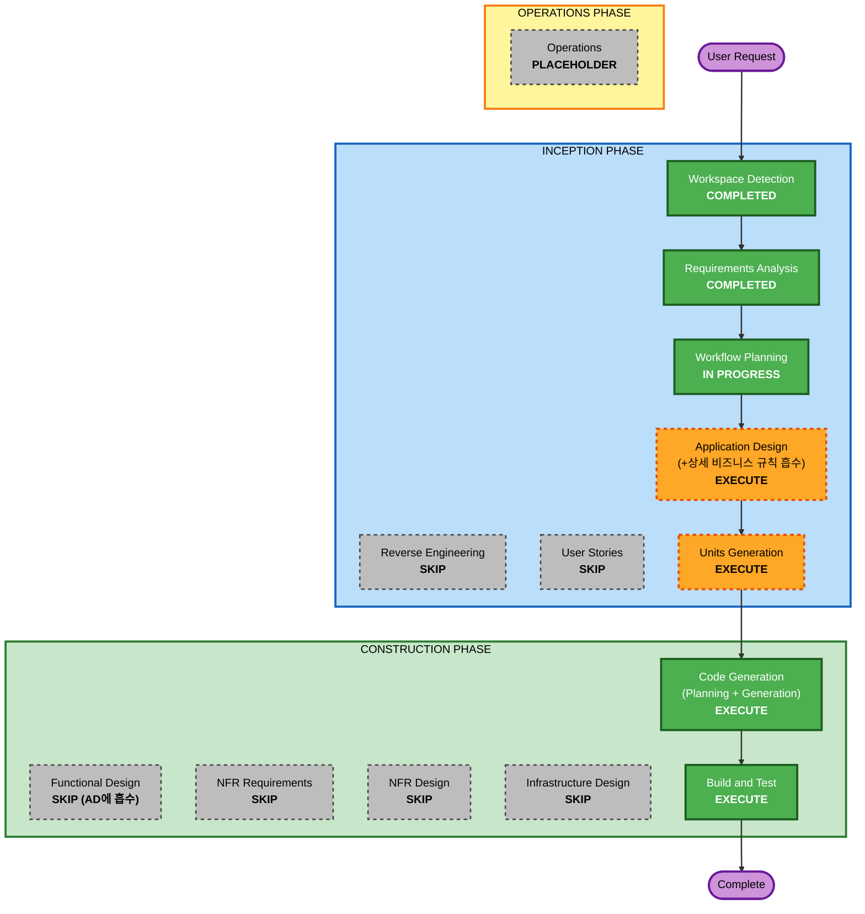

# Execution Plan (Workflow Planning)

/ Written at (KST): 2026-09-07 11:30 /

## Detailed Analysis Summary

### Change Impact Assessment
- **User-facing changes**: Yes — 고객 웹앱 + 관리자 웹앱 신규 구축
- **Structural changes**: Yes — 신규 시스템 아키텍처(FastAPI 단일 서버 + SQLite + 정적 프론트) 정의
- **Data model changes**: Yes — 전체 스키마 신규 설계 (stores, admin_users, tables, table_sessions, categories, menus, orders, order_items, order_history)
- **API changes**: Yes — REST + SSE 계약 신규 정의 (BE/FE 공통 준수)
- **NFR impact**: 제한적 — SSE 2초 반영, bcrypt/JWT, SQLite 지속성 수준. 고가용성/모니터링/CI-CD는 범위 외

### Risk Assessment
- **Risk Level**: Low–Medium (범위 명확, 로컬 단일 서버, 데모 규모)
- **Rollback Complexity**: Easy (신규 프로젝트, 파일 기반 DB)
- **Testing Complexity**: Moderate (세션 라이프사이클/총액/SSE 흐름 검증 필요)

## 핵심 방침: "모든 결정을 inception에 가둔다"
사용자 원칙에 따라, 통상 CONSTRUCTION의 **Functional Design(상세 비즈니스 로직)** 을 **Application Design(inception)** 문서 안으로 끌어올려 확정한다.
→ CONSTRUCTION에서는 방향/구현/기능에 대한 **새 결정이 발생하지 않고**, "정해진 대로 구현/빌드/테스트"만 남는다.

## Workflow Visualization

## Phases to Execute

### 🔵 INCEPTION PHASE
- [x] Workspace Detection (COMPLETED)
- [x] Reverse Engineering (SKIPPED)
  - **Rationale**: Greenfield — 분석할 기존 코드 없음
- [x] Requirements Analysis (COMPLETED)
- [x] User Stories (SKIP)
  - **Rationale**: 요구사항 문서가 이미 고객/관리자 페르소나와 기능·시나리오를 상세히 정의. 시간 박스(4-5h) + 데모 범위. (원하시면 추가 가능)
- [x] Workflow Planning (IN PROGRESS)
- [ ] Application Design — **EXECUTE**
  - **Rationale**: 사용자 요청의 핵심(BE/FE가 준수할 **API 규격**), **데이터 모델**, 컴포넌트/서비스 설계, **세션 라이프사이클 상태머신 및 상세 비즈니스 규칙**을 여기서 확정 → inception 잠금
- [ ] Units Generation — **EXECUTE (경량)**
  - **Rationale**: 단일 배포 단위(모놀리식 웹앱)로 정의하고 backend/frontend 모듈 경계 및 코드 조직 전략 확정

### 🟢 CONSTRUCTION PHASE
- [ ] Functional Design — **SKIP**
  - **Rationale**: 상세 비즈니스 로직을 Application Design(inception)으로 흡수했으므로 별도 스테이지 불필요. "모든 결정은 inception" 원칙 구현
- [ ] NFR Requirements — **SKIP**
  - **Rationale**: 3개 extension 모두 비활성, NFR 최소선(requirements §4)이 이미 확정
- [ ] NFR Design — **SKIP**
  - **Rationale**: 위와 동일
- [ ] Infrastructure Design — **SKIP**
  - **Rationale**: 클라우드 인프라 없음. 로컬 단일 FastAPI 서버 실행
- [ ] Code Generation — **EXECUTE (ALWAYS)**
  - **Rationale**: 확정된 설계대로 코드/테스트 생성
- [ ] Build and Test — **EXECUTE (ALWAYS)**
  - **Rationale**: 빌드·단위테스트·시나리오 수동 검증

### 🟡 OPERATIONS PHASE
- [ ] Operations — PLACEHOLDER

## Estimated Timeline (4-5h box 내)
- Application Design: ~30–40분
- Units Generation: ~10분
- Code Generation(백엔드+프론트+테스트): ~2.5–3시간
- Build & Test / 시나리오 검증: ~30–45분

## Success Criteria
- **Primary Goal**: 로컬에서 실행되어 고객 주문 → 관리자 실시간 모니터링 → 세션 종료까지 동작하는 MVP
- **Key Deliverables**: 실행 가능한 FastAPI 서버 + SQLite + 고객/관리자 웹 UI + 자동 시드 + 핵심 로직 단위테스트
- **Quality Gates**: requirements §6 시나리오 1~5 수동 통과, 핵심 로직 pytest 통과, API 응답이 확정 규격과 일치
